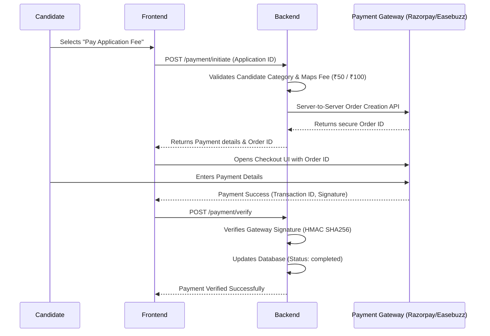

# BSSC Portal - Payment Integration Documentation

**Document Version:** 1.0.0  
**Target:** JTGLCCE-2026 Examination Portal  
**Date:** June 2026

---

## Table of Contents
1. [Overview](#1-overview)
2. [Fee Structure](#2-fee-structure)
3. [Payment Flow Architecture](#3-payment-flow-architecture)
4. [API Endpoints Specification](#4-api-endpoints-specification)
5. [Current Implementation & Action Items](#5-current-implementation--action-items)
6. [Environment Configuration](#6-environment-configuration)

---

## 1. Overview
This document outlines the technical implementation of the Payment Gateway module for the JTGLCCE-2026 Candidate Registration Portal. It covers the fee rules derived from the official brochure, the backend APIs responsible for generating payment orders, and the integration state of 3rd-party gateways (Razorpay, Easebuzz).

---

## 2. Fee Structure
Based on the official JTGLCCE-2026 brochures, the examination fee structure is dynamically mapped based on the candidate's reservation category and physical handicap (PwD) status.

| Candidate Category / Domicile | Examination Fee | Remarks |
| :--- | :--- | :--- |
| **Unreserved / General** | ₹ 100.00 | Standard Fee |
| **OBC / EWS / Other States** | ₹ 100.00 | Treated as Unreserved |
| **SC / ST (Jharkhand Domicile)** | ₹ 50.00 | Concession applied |
| **Persons with Benchmark Disabilities (PwD)** | ₹ 50.00 | 40% or more disability |
| **Ex-Servicemen** | ₹ 0.00 | Fully exempted |

### Backend Configuration
This fee logic is strictly enforced in the backend within `src/services/payment.service.ts`:
```typescript
const FEE_AMOUNTS: Record<string, number> = {
  general: 100,
  obc: 100,
  sc_st_ph: 50,
  exserviceman: 0,
};
```

---

## 3. Payment Flow Architecture

The payment process follows a 3-step sequence: Initiation, Gateway Processing, and Verification.



---

## 4. API Endpoints Specification

### 4.1 Initiate Payment
**Endpoint:** `POST /payment/initiate`  
**Description:** Calculates the fee based on category and creates a pending payment order.

**Request Payload:**
```json
{
  "applicationId": "uuid-of-application",
  "paymentMode": "online_card",
  "feeCategory": "sc_st_ph"
}
```

**Response Payload (Success):**
```json
{
  "status": "success",
  "message": "Payment initiated",
  "data": {
    "paymentOrderId": "order_XYZ123ABC",
    "amount": 5000, 
    "currency": "INR",
    "paymentUrl": "https://gateway..."
  }
}
```
*(Note: Amount is returned in paise for Razorpay compatibility, e.g., 5000 = ₹50.00)*

### 4.2 Verify Payment
**Endpoint:** `POST /payment/verify`  
**Description:** Securely validates the payment signature sent back by the gateway.

**Request Payload:**
```json
{
  "paymentOrderId": "order_XYZ123ABC",
  "razorpayPaymentId": "pay_XYZ123ABC",
  "razorpaySignature": "hashed_signature_string"
}
```

---

## 5. Current Implementation & Action Items

### 🛑 Critical Security & Functional Updates Required
The codebase currently contains mock setups for Razorpay that **will fail in a live production environment**. The following action items must be executed by the backend team:

1. **Implement Official Razorpay Node SDK:**
   - The project is currently generating fake UUIDs for Order IDs instead of securely calling the Razorpay API.
   - **Action:** Install the SDK (`npm install razorpay`) and implement `razorpay.orders.create({ amount, currency })` in the `initiatePayment` method.

2. **Remove Hardcoded Secrets:**
   - Secrets are currently exposed in plain text within `src/services/payment.service.ts` (e.g., `rzp_test_secret12345`).
   - **Action:** Read these values securely from `.env`.

3. **Consolidate Duplicate Services:**
   - There are currently overlapping functionalities across `src/services/payment.service.ts` and `src/services/gatewayPayment.service.ts`.
   - **Action:** Merge signature verification logic into a single reliable gateway adapter pattern to prevent asynchronous bugs.

---

## 6. Environment Configuration

The following variables must be properly configured in the `.env` file before deploying the payment module:

```env
# Payment Gateway Toggles
PAYMENT_MODE=live                  # Set to 'dummy' for local testing
ACTIVE_PAYMENT_GATEWAY=razorpay    # Options: razorpay, easebuzz

# Razorpay Credentials
RAZORPAY_KEY_ID=rzp_live_xxxxxxxxxx
RAZORPAY_SECRET=your_live_secret_key

# Easebuzz Credentials
EASEBUZZ_KEY=your_easebuzz_key
EASEBUZZ_SALT=your_easebuzz_salt
EASEBUZZ_ENV=prod                  # Options: test, prod
```
